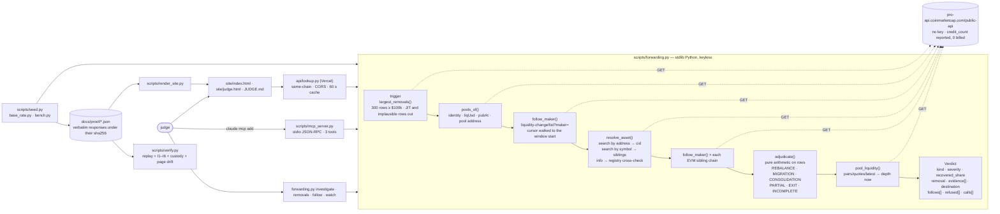

# Architecture

Derived from the code in this repository, not from a design document. Every function named
below exists in `scripts/`; every route named below answers; every dependency is greppable.
There is no database, no cache beyond a 60-second one inside the proxy function, no model of
our own, and no key anywhere.

## Shape of the thing

Forwarding Address is **one join that no endpoint performs** — the same `m` on a `remove` row
and an `add` row in different pools — wrapped in an investigation that a judge can run three
ways: as a CLI, as an MCP server inside their own Claude, and as an autonomous watch loop.



## One investigation, call by call

`investigate(platform, address)` in `scripts/forwarding.py` (12 calls for UNI; every one
printed as it happens, every one receipted):

| # | Call | What it is for |
|---|---|---|
| 0 | `GET /v1/dex/token` | card header: name, symbol, token liquidity — context, never an input to the verdict |
| 1–3 | `GET /v1/dex/liquidity-change/list?minVolume=100000` ×3 pages | the trigger: 300 rows, keyed `(txn, lgid)`, cursor from the envelope's `data.lastId`; a transaction that both adds and removes is JIT and is discarded; a row above `SANE_USD` is a price artefact and is refused |
| 4 | `GET /v1/dex/token/pools?size=20` | pool identity → address, depth now, creation time; the removal's share of its pool |
| 5 | `GET /v1/dex/liquidity-change/list?maker=<m>` | **the join** — the same wallet's events across every pool of the token, walked back to the window start |
| 6 | `GET /v1/dex/search?q=<address>` | the asset's CoinMarketCap id |
| 7 | `GET /v1/dex/search?q=<symbol>` | the same id on every other chain |
| 8 | `GET /v2/cryptocurrency/info?id=` | the canonical contract registry the sibling rows are checked against |
| 9–12 | `GET /v1/dex/liquidity-change/list?platform=<sibling>&maker=<m>` | the join again, on each EVM chain where the asset has ≥ $10k of DEX liquidity (UNI: bsc, arbitrum, unichain, polygon) |
| 13 | `GET /v4/dex/pairs/quotes/latest?contract_address=<dest>` | the destination pool's depth now (and the source pool's, when it is listed) |

Then `adjudicate()` — no network — and the `Verdict` dataclass, printed by `print_verdict()`
or serialised by `receipt()`.

## The arithmetic, in full

```
identity(row)    = (row.f, {row.t0a, row.t1a})                       # factory + unordered pair
adds             = same-maker rows in [ts−6h, ts+6h], tp == "add", JIT and implausible rows excluded
same             = Σ |tu| of adds with identity == identity(removal) on the same chain
other            = Σ |tu| of every other add (other pool, or another chain)
REBALANCE        same/|removed| ≥ 0.70 and same ≥ other
MIGRATION        other/|removed| ≥ 0.70           (CONSOLIDATION if destination.pubAt > removal.ts)
PARTIAL          0.10 ≤ (same+other)/|removed|
EXIT             otherwise, and every planned follow returned 200
INCOMPLETE       otherwise                                            # a throttle is never an Exit
recovered_share  = same/|removed| (REBALANCE) · other/|removed| (MIGRATION…) · total (PARTIAL)
elapsed_s        = ts(first add into the destination) − ts(removal)
```

Full statement with thresholds and invariants: [docs/SPEC.md](docs/SPEC.md).

## The three fields the whole product rests on

| Field | Endpoint | What it makes possible |
|---|---|---|
| `m` | `/v1/dex/liquidity-change/list` | the wallet. Verified the transaction sender's own address, never a position manager — 32 distinct makers on 71 Uniswap v3 rows (`docs/proof/spike_maker.json`). Without it there is nothing to join. |
| `maker=` | same endpoint, query parameter | the join in **one call**: the same wallet's adds and removes across every pool of the token, server-side. |
| `f`, `t0a`, `t1a` | same | pool identity. Rows carry no pool address; the factory plus the unordered pair is the closest stable key, and `f` is present even when `en` is not. |

## Failure handling

| Condition | Behaviour |
|---|---|
| HTTP 429 (error 1022 *or* 1011) / any 5xx / a dropped connection | transient: retried with 15 s, 30 s, 60 s backoff; a call that backed off and then answered records `attempts` in its receipt |
| throttled on every retry, on the trigger | `Throttled` → exit **75**, with what happened and the two ways through (wait, or the optional key) |
| throttled on a follow | that follow is `complete: false`; the verdict is INCOMPLETE if nothing was found, or a MIGRATION/REBALANCE marked incomplete if something was — never an EXIT (I6) |
| any other 4xx, malformed JSON, unreachable host | returned at once, never retried, never reported as a rate limit |
| no removal ≥ $100k, or every one below 10% of its pool | `NoCandidate` → exit **3**, a finding, with the refused rows and their reasons |
| a JIT transaction named by hash | `NoCandidate` — "not an event" |
| a row with `|tu|` above $10B | refused as a price-feed artefact, listed under `refused` |

## Repository layout

```
scripts/
  forwarding.py                 the product: Client, walk, largest_removals, follow_maker,
                                resolve_asset, pools_of, pool_liquidity, adjudicate, investigate,
                                watch, and the CLI (investigate · removals · follow · watch)
  mcp_server.py                 stdio JSON-RPC 2.0: where_did_liquidity_go · largest_removals · follow_maker
  seed.py                       the published selection rule → docs/proof/{hero,runner_up,exit,rebalance,jit}.json
  base_rate.py                  every ≥ $100k removal on the watchlist, each wallet followed → base_rate.json
  bench.py                      p50/p95: investigate end to end, follow, adjudicate — live and replay
  verify.py                     replay every receipt, assert I1–I6 and chain of custody, check page drift
  render_site.py                docs/proof/*.json → site/index.html + site/judge.html + JUDGE.md (--check = drift gate)
  check_submission_readiness.py placeholders, stale counts, stale numbers → exit 1
  spike_maker.py                the day-1 spike: is `m` the wallet? (answered: yes)
  site_templates/               landing.html, judge.html, JUDGE.md — slot tokens filled only from receipts
api/
  lookup.py                     GET /api/lookup?platform=&address= — same-chain investigate, CORS, 60 s cache
  health.py                     GET /api/health — engine, rule, receipt ages, python version
tests/
  conftest.py                   live-shaped rows and a routed FakeClient whose receipts come from the real _record()
  test_adjudicate.py            the rule, threshold by threshold; regressions named for the live defect they pin
  test_fetch.py                 keyless default, backoff, the cursor, dedupe, stall, attempts
  test_investigate.py           every branch: JIT, share, throttle, cross-chain, Solana, registry, watch()
  test_property.py              2,000 hypothesis cases over adjudicate(): I1–I6 never violated
  test_cli.py                   exit codes 0/3/75/2, the receipt file, what is printed
  test_mcp.py                   the protocol over a real pipe; the three tools; the refusal
  test_published_counts.py      the counts the documents state are the counts pytest collects
  test_boundary.py              least privilege, proven: the agent surface cannot send or be handed a key; the proxy takes a slug and an address, same chain, no secret
  test_live.py                  10 tests against the real API and the deployment (pytest -m live)
docs/
  SPEC.md                       the rule, formally
  proof/                        hero · runner_up · exit · rebalance · uni_v3_v4 · jit · base_rate ·
                                live_run · bench_live · bench_replay · spike_maker · seed_sweep ·
                                mcp_session.md + .jsonl · tests.json
site/                           index.html and judge.html (rendered — /judge is JUDGE.md converted), assets/ (icon, fonts under OFL)
```

## Deliberate non-architecture

| Not present | Why |
|---|---|
| A model of our own | The judge's Claude is the model in the loop; it chooses the token and the removal, and deterministic code decides what is true. An LLM producing the recovered share would fail the track's own gate. |
| A database | Every verdict is recomputed from live rows; receipts are committed JSON. |
| A key | Every endpoint used is on the keyless surface, so the proxy holds no secret and judge traffic bills nothing. `CMC_API_KEY` is honoured only as an escape hatch for a throttled IP, and a keyed run announces itself on its first line, its last line and in its receipt. |
| Runtime dependencies | `forwarding.py` and `mcp_server.py` import only the standard library, so a judge runs them on a clean machine. `pytest`, `hypothesis` and `ruff` are dev-only. |
| A pool address on the row | The API does not carry one; identity is venue + pair, and the limit is stated rather than guessed around. |
