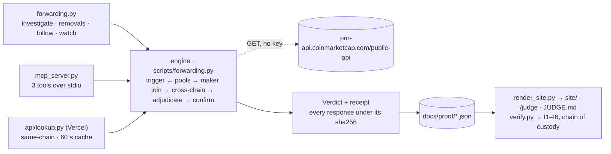

<div align="center">



<h1>Forwarding Address ↪</h1>

<p><em>Where the pulled liquidity went.</em></p>

<p align="center">
  
</p>

<p>Every “LP removed” alert stops at the row that fired it. Forwarding Address follows the
<strong>wallet</strong> — across every pool of the token, on this chain and on every other EVM
chain the same asset trades on — and rewrites the alert: <strong>Rebalance</strong>,
<strong>Migration</strong>, <strong>Partial</strong>, or a real <strong>Exit</strong>.</p>

<p><strong>Live, keyless, 2026-09-18:</strong> a wallet pulled <strong>$21,330,275</strong> out of
Ring Exchange UNI/WBTC. <strong>2 min 12 s later the same wallet put 99.8% of it — the same
1,962,475.5391248302 UNI — into Ring Exchange UNI/WETH.</strong> The alert was true. The panic
was not. <a href="DEMO.md">Receipt →</a></p>

<br/>

[](https://forwarding.edycu.dev/judge)
[](https://forwarding.edycu.dev)
[](https://forwarding.edycu.dev/pitch/)
[](docs/proof/mcp_session.md)
[](FEEDBACK.md)
[](https://dorahacks.io/hackathon/coinmarketcap-api-202609/detail)

<br/>


[](https://github.com/edycutjong/forwarding/releases/latest)
[](https://github.com/edycutjong/forwarding/actions/workflows/ci.yml)
[](LICENSE)

</div>

---

## 📸 See it in Action

No key. No signup. No install. One command:

```bash
python3 scripts/forwarding.py investigate --platform ethereum --address 0x1f9840a85d5af5bf1d1762f925bdaddc4201f984
```

```
forwarding address — keyless · ethereum · 0x1f9840a85d5af5bf1d1762f925bdaddc4201f984

  following the wallet
    GET /v1/dex/token                    platform=ethereum address=0x1f9840…01f984                  200   487 ms 
    GET /v1/dex/liquidity-change/list    platform=ethereum address=0x1f9840…01f984 minVolume=100000 200  1004 ms  100 rows
    GET /v1/dex/liquidity-change/list    platform=ethereum address=0x1f9840…01f984 minVolume=100000 lastId=AVd6RTNP…E9PQ== 200   641 ms  100 rows
    GET /v1/dex/liquidity-change/list    platform=ethereum address=0x1f9840…01f984 minVolume=100000 lastId=AVd6RTNP…YwPQ== 200   573 ms  100 rows
    GET /v1/dex/token/pools              platform=ethereum address=0x1f9840…01f984 size=20          200   516 ms  20 items
    GET /v1/dex/liquidity-change/list    platform=ethereum address=0x1f9840…01f984 maker=0x4f0aa5…8bb9a9 200   806 ms  2 rows
    GET /v1/dex/search                   q=0x1f9840…01f984                                          200   466 ms  4 tokens
    GET /v1/dex/search                   q=UNI                                                      200  1180 ms  50 tokens
    GET /v2/cryptocurrency/info          id=7083                                                    200   297 ms 
    GET /v1/dex/liquidity-change/list    platform=bsc address=0xbf5140…2ce9b1 maker=0x4f0aa5…8bb9a9 200   522 ms  0 rows
    GET /v1/dex/liquidity-change/list    platform=arbitrum address=0xfa7f89…f1f7f0 maker=0x4f0aa5…8bb9a9 200   501 ms  0 rows
    GET /v1/dex/liquidity-change/list    platform=unichain address=0x8f187a…e9ea21 maker=0x4f0aa5…8bb9a9 200   541 ms  0 rows
    GET /v1/dex/liquidity-change/list    platform=polygon address=0xb33eaa…b5180f maker=0x4f0aa5…8bb9a9 200   955 ms  0 rows
    GET /v4/dex/pairs/quotes/latest      network_slug=ethereum contract_address=0x8626be…4a7306     200   647 ms  1 items

  ● LP REMOVED  −$21,330,275   Ring Exchange (Ethereum) · UNI/WBTC   2026-09-02 03:59:11 UTC
    maker 0x4f0aa5900b8292273b2f9a178d5468f8048bb9a9 · share of pool unknown · txn 0x5081d9…dcd495

  ◆ MIGRATION · severity amber
    99.8% recovered — $21,287,255 of $21,330,275
    +$21,287,255 into Ring Exchange (Ethereum) · UNI/WETH (ethereum)   2 min 12 s later · pool now holds $102,239,395

  the rows (verbatim fields)
    remove  ts=1788321551000 tu=-21330274.564875204 m=0x4f0aa5900b8292273b2f9a178d5468f8048bb9a9 en=Ring Exchange (Ethereum) a0=-1962475.5391248302 txn=0x5081d9…dcd495
    add     ts=1788321683000 tu=21287254.934237212 m=0x4f0aa5900b8292273b2f9a178d5468f8048bb9a9 en=Ring Exchange (Ethereum) a0=1962475.5391248302 txn=0x9fafe3…71a0f3  [ethereum]
    21,287,254.93 ÷ 21,330,274.56 = 0.9980

  14 calls · 14 × 200 · 0 credits · 50.6 s · keyless
```

> **That is a live run against CoinMarketCap's keyless `/public-api` surface. Nothing here is a
> fixture.** These exact lines are from **2026-09-18T23:36:32Z** — run it yourself and the removal
> it picks may differ, because it comes from the market rather than from this file. The full
> receipt, with every response embedded under the sha256 the trace cites, is committed at
> [`docs/proof/live_run.json`](docs/proof/live_run.json) and walked through in **[DEMO.md](DEMO.md)**.

**Read the two rows.** A wallet removed 1,962,475.54 UNI and 137.96 WBTC from one pool. 132
seconds later the *same wallet* added the *same* 1,962,475.5391248302 UNI, now paired with WETH,
to the pool next door. Every LP-removal alert in existence stops at the first row, red. The
second row is in the same API, one `maker=` query away, and nobody joins it.

---

## 💡 The Problem & Solution

### The Problem

Following one removal proves the mechanism. Following **335** measures how often the alert is
the wrong headline — every non-JIT removal ≥ $100k across an 11-token, 3-chain watchlist, each
wallet followed one at a time ([`base_rate.json`](docs/proof/base_rate.json)):

| Outcome of a “≥ $100k removed” alert | Count | Share |
|---|---|---|
| **Rebalance** — the same wallet put ≥ 70% back into the same pool | 194 | 57.9% |
| **Migration** — the same wallet put ≥ 70% into a different pool | 19 | 5.7% |
| **Partial** — 10–70% came back | 10 | 3.0% |
| No same-wallet re-add within ±6 h on that chain *(an upper bound on true exits)* | 112 | 33.4% |

**Two in three “liquidity pulled” alerts were the same wallet putting it back within six hours.**
Marco, who runs a DAO treasury's Telegram alert bot, gets several of these a week and cannot
tell them apart from the alert.

### The Solution

The alert arrives already adjudicated, with the two rows. This is the *AI Agents & Automation*
entry, and the agent is not a paragraph:

- **It branches on its own test.** A large removal fires → a same-transaction add makes it JIT,
  refused → otherwise the wallet is followed across every pool of the token, then across every
  EVM chain where the same CoinMarketCap asset has a market → five-way adjudication → the
  destination pool's depth is confirmed live → **the agent rewrites its own alert severity**
  (red → amber → grey).
- **It runs unattended.** `forwarding.py watch` polls a watchlist, fires on every new qualifying
  removal, adjudicates it, and optionally POSTs the verdict to a webhook.
- **It is an MCP server.** Three tools over stdio, stdlib only, one line to install:

  ```bash
  claude mcp add forwarding -- python3 $PWD/scripts/mcp_server.py
  ```

  Your model chooses the token and the removal; the tool decides what is true. A real Claude
  Code session — `largest_removals`, then `where_did_liquidity_go`, then the JIT refusal, every
  figure quoted from a tool result — is committed verbatim in
  [`docs/proof/mcp_session.md`](docs/proof/mcp_session.md).
- **No model of ours produces a number.** Every float in a verdict is a sum or a ratio of `tu`
  fields on API rows (invariant I1). An LLM that *narrated* a recovered share would fail this
  track's own gate: a plain API call plus a paragraph is still a plain API call.

---

## 🏗️ Architecture & Tech Stack

```
trigger     300 rows ≥ $100k · drop any txn that both adds and removes (JIT) · drop |tu| > $10B (artefacts)
pools       identity = (factory, {token0, token1}) · depth now · creation time · the removal's share of its pool
follow      liquidity-change/list?maker=<wallet>   ← THE JOIN, one call, walked back to the window start
cross-chain search by address → cid · search by symbol → the same cid elsewhere · info → registry check · follow each
adjudicate  REBALANCE ≥70% same pool · MIGRATION ≥70% elsewhere (CONSOLIDATION if the pool is newer than the removal)
            PARTIAL ≥10% · EXIT nothing, every follow 200 · INCOMPLETE a follow failed — never an Exit
confirm     pairs/quotes/latest → the destination pool's depth now
```

<details>
<summary><b>Architecture diagram</b> (click to expand)</summary>



</details>

| Layer | Technology |
|---|---|
| Engine, CLI, watch loop | Python 3.11, **stdlib only** — no install step on the judged path |
| Agent surface | MCP server, newline-delimited JSON-RPC 2.0 over stdio, three tools; a real Claude Code session committed |
| Data | CoinMarketCap DEX API, keyless `/public-api` surface — six endpoints, 0 credits |
| Web surface | Static site rendered from receipts + two Python functions on Vercel (`/api/lookup`, `/api/health`) |
| Tests | pytest · **hypothesis** (property-based) · live contract tests · boundary tests |
| Quality | ruff · mypy · pytest-cov (90% gate) · pip-audit · gitleaks · CodeQL · Dependabot |

No database, no cache beyond 60 seconds inside the proxy, no model of our own, no key anywhere.
The rule, its thresholds, the state machine and the six invariants are one page:
[docs/SPEC.md](docs/SPEC.md). The architecture, derived from the code: [ARCHITECTURE.md](ARCHITECTURE.md).
Rendered page, light and dark: [forwarding.edycu.dev/architecture](https://forwarding.edycu.dev/architecture).

---

## 🏆 CoinMarketCap Integration

Six endpoints, all keyless, 0 credits, every one called from [`scripts/forwarding.py`](scripts/forwarding.py):

| Endpoint | What the agent takes from it |
|---|---|
| `/v1/dex/liquidity-change/list` | the trigger, and — with `maker=` — **the join**: one wallet's adds and removes across every pool of the token |
| `/v1/dex/token/pools` | pool identity → address, depth now (share of pool), creation time (Consolidation) |
| `/v1/dex/search` | address → CoinMarketCap id, then the same id on every other chain |
| `/v2/cryptocurrency/info` | the canonical cross-chain contract registry the sibling rows are checked against |
| `/v4/dex/pairs/quotes/latest` | the destination pool's depth now, and the source pool's |
| `/v1/dex/token` | the card header: name, symbol, token liquidity |

### Why only CoinMarketCap

`/v1/dex/liquidity-change/list` returns, per liquidity event and with no key, the maker's own
wallet (`m` — verified never a position manager: 32 distinct makers on 71 Uniswap v3 rows,
[`spike_maker.json`](docs/proof/spike_maker.json)), and it accepts `maker=` as a server-side
filter. That one parameter is the product: the same wallet's adds in every other pool of the
token come back in a single call. `/v1/dex/token/pools` gives every pool the wallet could have
moved to, with its depth and its creation time; `/v1/dex/search` and `/v2/cryptocurrency/info`
agree on which contract on which other chain is the *same* asset; `/v4/dex/pairs/quotes/latest`
confirms the depth actually arrived.

Remove CoinMarketCap and reproducing the join needs a multi-chain liquidity-event indexer, a
per-DEX pool registry, a cross-chain contract registry and a pool-depth oracle — four systems to
replace six free endpoints. Where the API got in the way is written up for the CMC team, with
dates and receipts, in **[FEEDBACK.md](FEEDBACK.md)**.

---

## ⛓️ Live Deployment

**No wallet needed anywhere — every page is a read-only call.**

| | |
|---|---|
| **For judges** | [forwarding.edycu.dev/judge](https://forwarding.edycu.dev/judge) — the claim, the 30-second path, the receipt, the reproduce command, the limitations. No auth, no cookie, no redirect. The same page as [JUDGE.md](JUDGE.md), rendered from the same receipts. |
| **Landing page** | [forwarding.edycu.dev](https://forwarding.edycu.dev) — the receipt, the red-to-amber flip, the two rows, the base rate, and a live box. One host: Vercel serves the page and the functions at this domain; `forwarding.edycu.dev` is the deployment alias and redirects here |
| **Pitch deck** | [forwarding.edycu.dev/pitch](https://forwarding.edycu.dev/pitch/) — 11 slides, arrow keys, `P` for notes, `Cmd+P` for a PDF; rendered from the same receipts as this page |
| **Live proxy** | `GET /api/lookup?platform=ethereum&address=0x…` — the same-chain investigation through a keyless CORS proxy (CMC sends no CORS header, so a browser cannot call it directly). Holds no secret because no endpoint needs one. |
| **Health** | [`/api/health`](https://forwarding.edycu.dev/api/health) — the engine, the rule, the receipts' ages, and `key_exported: false` |

The hosted live box shares one IP across every visitor against a per-IP anonymous rate limit,
so the page leads with the dated receipt and the CLI is the surface with a quota of your own.

---

## 📊 Engineering Rigor

| Measurement | Value |
|---|---|
| Live run wall clock | **50.6 s** — 14 keyless calls including one 15 s backoff ([`live_run.json`](docs/proof/live_run.json)); clean path p50 **27.0 s**, p95 28.0 s (n=5) |
| **Credits used** | **0** — keyless, with every CMC env var explicitly unset |
| Tests | **126** offline tests (~10 s, no network) + 10 live against the real contract and the deployment |
| Regression tests named for the live defect they pin | 12 |
| **Property-based verification of `adjudicate()`** | **2,000 generated investigations, 0 failing** — invariants I1–I6 never violated |
| Permission-boundary tests | 4 — the agent surface cannot send or be handed a key; the proxy takes a slug and an address, same chain, no secret |
| `make verify` | replays every committed receipt, asserts the invariants, checks every evidence row is verbatim inside a stored response, fails if the page drifted |
| Adjudication replay | p50 **0.004 ms**, byte-identical 1,000/1,000 ([`bench_replay.json`](docs/proof/bench_replay.json)) |
| Coverage of the judged path | 90.6% of `scripts/forwarding.py`, `scripts/mcp_server.py`, `api/` — `make test-coverage` fails under 90 |

**The 2,000 is the number worth reading.** Coverage says we ran the lines we wrote. The property
test says that across 2,000 generated investigations — any removal size, any mix of adds across
the source pool, other pools and other chains, any completion state — `adjudicate()` never once
certified a re-add it did not see, never named the source pool as a destination, never called
a throttled follow an Exit, and produced the same bytes on a second run.

### Attacks defeated

| Control | Why it is load-bearing | Pinned by |
|---|---|---|
| A transaction that both adds and removes is refused, never adjudicated | 85 of 100 PEPE rows were just-in-time pairs; counting them makes every alert a Rebalance | `tests/test_investigate.py::test_a_jit_transaction_named_by_txn_is_refused_as_not_an_event` |
| A row above $10B is a price artefact, not a removal | 13 CAKE rows carried `tu = -1e42` and out-ranked every real event ([FEEDBACK.md](FEEDBACK.md) #1) | `tests/test_adjudicate.py::test_a_usd_value_larger_than_every_market_on_earth_is_a_price_artefact_not_a_removal` |
| A throttled follow is INCOMPLETE, never an Exit | a 429 on one sibling chain must not read as “the liquidity left” | `tests/test_adjudicate.py::test_a_throttled_follow_is_incomplete_never_an_exit` |
| The same wallet's removes inside the window never count as recovery | otherwise a wallet cycling out twice reads as putting money back | `tests/test_adjudicate.py::test_removes_by_the_same_wallet_in_the_window_are_never_counted_as_recovery` |
| A removal below 10% of its pool is skipped, share printed | $4M out of a $170M pool is large in dollars and small for the pool | `tests/test_investigate.py::test_a_removal_that_is_a_sliver_of_its_pool_is_refused_and_the_next_one_taken` |
| The plan-gated `startTime` parameter is never sent | it 403s keyless; the window is walked with the cursor instead | `tests/test_investigate.py::test_the_window_is_enforced_by_the_cursor_walk_not_by_start_time` |
| The default path sends no key; a keyed run names itself | a keyed receipt can never pass as the keyless one | `tests/test_fetch.py::test_default_path_sends_no_key_and_uses_the_public_surface` · `tests/test_cli.py::test_the_mode_line_names_a_keyed_run_so_it_can_never_pass_as_keyless` |
| No MCP tool can send data anywhere or accept a credential, however its arguments are padded | an injected prompt cannot turn the agent into an exfiltration path | `tests/test_boundary.py::test_no_tool_on_the_agent_surface_can_send_data_anywhere_or_be_handed_a_credential` |
| The hosted proxy accepts exactly a chain slug and an EVM address, same chain only | one visitor is six calls on a shared IP, never a fan-out or a fetch of a URL of their choosing | `tests/test_boundary.py::test_the_hosted_proxy_refuses_anything_but_a_chain_slug_and_an_evm_address` |
| The test count and the killer number the documents state are the ones the repository holds | a README that says 126 over a suite of 90 is a lie a judge checks in ten seconds | `tests/test_published_counts.py::test_the_test_count_each_judged_document_states_matches_pytest` |

### Honest limits (8)

1. **Pool identity is venue + pair, not pool address.** Rows carry no pool contract; two fee
   tiers of one pair on one venue collapse into one identity, and the removal's share of its
   pool is unknown when the pool is not in the 20 the API returns (as in the run above).
2. **The window is ±6 h.** A wallet that comes back a day later reads as an Exit for that
   window, and the card says which window it searched.
3. **A wallet that cycles more than once inside the window** can show a share over 100% —
   adds are attributed to the whole window; the verdict counts and discloses the other removals.
4. **A wallet is not an entity.** Liquidity moved through a second wallet is not followed.
5. **Solana** is refused as a cross-chain destination — a Solana maker cannot be this wallet.
6. **The anonymous tier throttles per IP** and reports it as error 1022 or 1011, sometimes as a
   500. The tool backs off (15 s, 30 s, 60 s), records every retry in the receipt, and exits
   **75** with the way through when the quota is exhausted.
7. **The base rate follows wallets on the same chain only** — its EXIT count is an upper bound
   on true exits, to keep 335 follows inside one IP's anonymous quota. The product's
   investigation follows every sibling chain; the base rate says which method produced its number.
8. **A `tu` of 10⁴² exists in the feed** (CAKE on BSC, an unlabeled venue). Rows above $10B
   are refused as price-feed artefacts and listed under `refused`; the finding went to CMC.

### What we got wrong — dated, and kept

- **2026-09-19 — the seed rule and the demo rule disagreed on the hero.** `seed.py` first swept
  one page per token at $25k and chose the UNI v3→v4 $2.9M migration; the zero-flag command
  sweeps 300 rows at $100k and found a $21.3M one. Two published rules, two heroes, is a
  confusion. The seed now uses the trigger's own depth, the demo command and the receipts agree,
  and the v3→v4 event is kept as [`uni_v3_v4.json`](docs/proof/uni_v3_v4.json) — the event the
  mechanism was found on, not the largest.
- **2026-09-19 — a Rebalance printed “0 s later”.** The removal row sits inside its own window
  and the elapsed time was taken from it instead of from the first add back. Fixed; pinned by
  `test_a_rebalance_measures_elapsed_to_the_first_add_not_to_the_removal_itself`.
- **2026-09-19 — a $10⁴² “removal” topped the sweep.** The feed carries rows no market produced;
  the rule now refuses them and names them, and the finding went to CMC.
- **2026-09-19 — the landing and judge pages printed “0.0% of the pool”** for a removal whose
  share is unknown (its pool is not among the 20 the API returns). A number no row supports was on
  the judged surface. The renderer now says “an unknown share”, and `make check` refuses the page
  otherwise.
- **2026-09-19 — six committed receipts tripped the secret scanner.** CMC's info endpoint labels
  a contract address `token_address`, and gitleaks read the word beside 40 hex characters as a
  key. The allowlist admits exactly a 20-byte EVM address and nothing else; a real key beside
  the same address still fails the scan, and that was checked before it was committed.

---

## 🚀 Getting Started

### Prerequisites

- Python 3.11 or newer. That is the entire list.
- **No API key, no account, no `pip install`.** `forwarding.py` and `mcp_server.py` are stdlib-only.

### Installation

```bash
git clone https://github.com/edycutjong/forwarding.git && cd forwarding
python3 scripts/forwarding.py investigate --platform ethereum --address 0x1f9840a85d5af5bf1d1762f925bdaddc4201f984
```

> **For judges:** there is no account to create and no credential to configure — the judged path
> is keyless by design. Start at **[forwarding.edycu.dev/judge](https://forwarding.edycu.dev/judge)**.

```bash
python3 scripts/forwarding.py removals    --platform ethereum --address 0x514910771af9ca656af840dff83e8264ecf986ca
python3 scripts/forwarding.py follow      --platform ethereum --address 0x1f9840a85d5af5bf1d1762f925bdaddc4201f984 --maker 0x4f0aa5900b8292273b2f9a178d5468f8048bb9a9
python3 scripts/forwarding.py watch --cycles 1            # the autonomous loop, one pass over 11 tokens
claude mcp add forwarding -- python3 $PWD/scripts/mcp_server.py   # the agent surface
```

Exit **0** = verdict, **3** = nothing qualified, **75** = the anonymous tier is throttling this
IP (wait a minute). The tier is per IP and undocumented; the tool backs off 15/30/60 s, records
every retry in the receipt, and a keyed run (`CMC_API_KEY`, optional, an escape hatch) announces
itself so it can never pass as keyless.

---

## 🧪 Testing & CI

```bash
make setup           # dev deps only (pytest, pytest-cov, hypothesis, ruff, mypy, pip-audit)
make lint            # ruff check + format check
make typecheck       # mypy over scripts/ and api/
make test            # 126 offline tests, no internet
make test-coverage   # the same, coverage of the judged path gated at 90%
make test-live       # 10 tests against the real CoinMarketCap contract and the deployment
make demo            # the judged capability, live, zero config
make verify          # replay every receipt, I1–I6, chain of custody, page drift
make check           # refuse to ship a placeholder, a stale count or a drifted page
make audit           # pip-audit over both requirement files + gitleaks over full history
make ci              # lint typecheck test-coverage verify check audit
```

| Layer | Tool | Status |
|---|---|---|
| Code quality | ruff (check + format) · mypy | ✅ |
| Unit testing | pytest, 126 offline tests, 90% coverage gate on the judged path | ✅ |
| Property testing | hypothesis, 2,000 cases over `adjudicate()` | ✅ |
| Boundary testing | the agent surface and the hosted proxy, least privilege proven | ✅ |
| Live contract testing | pytest `-m live` against real CMC and the deployment; a throttle skips, never passes | ✅ |
| Security (SAST) | CodeQL, weekly and on every PR | ✅ |
| Security (SCA) | Dependabot (grouped, monthly) + pip-audit in CI | ✅ |
| Secret scanning | gitleaks, full history, every push | ✅ |
| Release automation | semver from Angular-convention commits | ✅ |
| Deployment | gated: `vercel build` + `vercel deploy --prebuilt --prod` on `main` only, after every stage above | ✅ |

CI runs four stages on every push: lint + typecheck and the tests with their coverage gate on
Python 3.11/3.12/3.13; pip-audit and the no-placeholder / no-drift gate; a replay of every
committed receipt through the invariants plus the deterministic benchmark; **and a `live-api`
job that follows the wallet for real, keyless, then runs the live contract and deployment
tests.** On `main`, a fifth stage gates on all of those and a sixth deploys the exact commit to
Vercel — `forwarding.edycu.dev` is the production domain. The only secret in the pipeline is
that deploy token; the product itself needs none, so every test job runs on forks and PRs. If
CMC changes the contract, it breaks in CI rather than in front of a judge; if CMC throttles the
shared runner IP, the job says so as a warning rather than reporting someone else's traffic as
our breakage.

**The landing page, the judge page, the pitch deck and JUDGE.md are generated, never hand-edited.**
`scripts/render_site.py` renders all four from the receipts in `docs/proof/`; every figure is a
slot filled from a committed JSON, the render aborts if any slot is unfilled, and CI re-renders
and fails on any diff. The test counts on this page are checked against `pytest --collect-only`
by the same gate.

---

## 📁 Project Structure

```
forwarding/
├── scripts/
│   ├── forwarding.py                 the product — trigger, join, cross-chain, adjudicate, confirm; CLI + watch loop
│   ├── mcp_server.py                 the agent surface — three tools over stdio, stdlib
│   ├── seed.py · base_rate.py        capture the receipts and the 335-removal base rate (live, keyless)
│   ├── bench.py                      p50/p95, live and replay, timed apart
│   ├── verify.py                     replay every receipt: I1–I6, chain of custody, page drift
│   ├── render_site.py                docs/proof/*.json → site/index.html · site/judge.html · site/pitch/index.html · JUDGE.md
│   └── check_submission_readiness.py placeholder, stale-count and stale-number scanner
├── api/lookup.py · api/health.py     the Vercel functions — keyless, same-chain, CORS
├── tests/                            126 offline + 10 live; boundary · property · regressions named for defects
├── site/                             generated: the landing page (/), the judge page (/judge), the deck (/pitch) — served by Vercel
├── docs/proof/                       hero · runner_up · exit · rebalance · uni_v3_v4 · jit · base_rate · live_run · benchmarks · spike · MCP session
├── docs/SPEC.md                      the rule: thresholds, state machine, invariants I1–I6
├── docs/COMPARISON.md · docs/screenshots/   the field, by name; the product, as captured
├── JUDGE.md · DEMO.md · ARCHITECTURE.md · FEEDBACK.md
└── README.md                         you are here
```

---

## 🗺️ Roadmap

- [x] The join — `liquidity-change/list?maker=` across every pool of the token, walked to the window start
- [x] JIT refusal, price-artefact refusal, sliver refusal — each with the reason printed
- [x] Cross-chain fan-out through `search` → `cid` → `info`, Solana refused, thin siblings skipped
- [x] Five-way adjudication with the six invariants, verified by property over 2,000 cases
- [x] MCP server with a real Claude Code session committed
- [x] Autonomous watch loop with a per-token high-water mark and an optional webhook
- [x] Live deployment: landing page, `/judge`, `/pitch`, keyless `/api/lookup`, `/api/health` — one host, forwarding.edycu.dev on Vercel
- [x] Base rate over 335 removals, benchmarks, receipts for every branch
- [ ] Demo video — recorded against the live product, at real speed, with the trace on screen
- [ ] A 24-hour unattended `watch` log catching a real removal as it lands (`docs/proof/watch_24h.log`)
- [ ] Following liquidity through a second wallet — deliberately not built: a wallet is not an entity, and guessing one would put a number on the card that no row supports

---

## 📽️ Demo Materials

| | |
|---|---|
| **For judges** | **[forwarding.edycu.dev/judge](https://forwarding.edycu.dev/judge)** · [JUDGE.md](JUDGE.md) — the 30-second path |
| **The receipt** | **[DEMO.md](DEMO.md)** — the live run transcribed, with [`docs/proof/live_run.json`](docs/proof/live_run.json) behind it |
| **Landing page** | **[forwarding.edycu.dev](https://forwarding.edycu.dev)** — the receipt beside its raw rows, and a live box |
| **Pitch deck** | **[forwarding.edycu.dev/pitch](https://forwarding.edycu.dev/pitch/)** — 11 slides from the same receipts; `P` for speaker notes, print to PDF |
| **The agent, for real** | [`docs/proof/mcp_session.md`](docs/proof/mcp_session.md) — a Claude Code session: three tool calls, the JIT refusal, every figure from a tool result |
| **How it works** | [ARCHITECTURE.md](ARCHITECTURE.md) · [docs/SPEC.md](docs/SPEC.md) |
| **API feedback for CMC** | [FEEDBACK.md](FEEDBACK.md) — where the API got in the way, with dates and receipts |
| **How it differs from the other entries** | [docs/COMPARISON.md](docs/COMPARISON.md) — the six closest entries in this hackathon, by name, with the exact boundary to each |
| **Screenshots** | [docs/screenshots/](docs/screenshots/) — the live page, the two rows, the base rate, the judge page, and a real keyless run captured 2026-09-19 |

---

## 📄 License

MIT — see [LICENSE](LICENSE). © 2026 Edy Cu.

---

## 🙏 Acknowledgments

Built by [Edy Cu](https://github.com/edycutjong) for the
**[Build with CMC: API Hackathon](https://dorahacks.io/hackathon/coinmarketcap-api-202609/detail)**,
**AI Agents & Automation** track. Thank you to the CoinMarketCap team for exposing the maker
address on every liquidity event of a keyless endpoint, and for accepting `maker=` as a filter —
that one parameter is the join this project is built on; our feedback on the rest of the API is
in [FEEDBACK.md](FEEDBACK.md).
