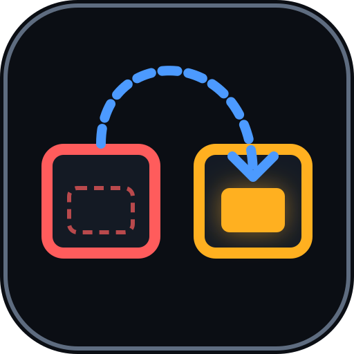

<div align="center">



<h1>Forwarding Address</h1>

<p><em>Where the pulled liquidity went.</em></p>

<p>Every “LP removed” alert stops at the row that fired it. Forwarding Address follows the
<strong>wallet</strong> — across every pool of the token, on this chain and on every other EVM
chain the same asset trades on — and rewrites the alert: <strong>Rebalance</strong>,
<strong>Migration</strong>, <strong>Partial</strong>, or a real <strong>Exit</strong>.</p>

<p><strong>Live, keyless, 2026-09-18:</strong> a wallet pulled <strong>$21,330,275</strong> out of
Ring Exchange UNI/WBTC. <strong>2 min 12 s later the same wallet put 99.8% of it — the same
1,962,475.5391248302 UNI — into Ring Exchange UNI/WETH.</strong> The alert was true. The panic
was not. <a href="DEMO.md">Receipt →</a></p>

<br/>

[](JUDGE.md)
[](https://forwarding-cmc.vercel.app)
[](docs/proof/mcp_session.md)
[](FEEDBACK.md)
[](https://dorahacks.io/hackathon/coinmarketcap-api-202609/detail)

<br/>


[](LICENSE)

</div>

---

## 📸 See it in Action

No key. No signup. No install. One command:

```bash
python3 scripts/forwarding.py investigate --platform ethereum --address 0x1f9840a85d5af5bf1d1762f925bdaddc4201f984
```

```
forwarding address — keyless · ethereum · 0x1f9840a85d5af5bf1d1762f925bdaddc4201f984

  following the wallet
    GET /v1/dex/token                    platform=ethereum address=0x1f9840…01f984                  200   487 ms 
    GET /v1/dex/liquidity-change/list    platform=ethereum address=0x1f9840…01f984 minVolume=100000 200  1004 ms  100 rows
    GET /v1/dex/liquidity-change/list    platform=ethereum address=0x1f9840…01f984 minVolume=100000 lastId=AVd6RTNP…E9PQ== 200   641 ms  100 rows
    GET /v1/dex/liquidity-change/list    platform=ethereum address=0x1f9840…01f984 minVolume=100000 lastId=AVd6RTNP…YwPQ== 200   573 ms  100 rows
    GET /v1/dex/token/pools              platform=ethereum address=0x1f9840…01f984 size=20          200   516 ms  20 items
    GET /v1/dex/liquidity-change/list    platform=ethereum address=0x1f9840…01f984 maker=0x4f0aa5…8bb9a9 200   806 ms  2 rows
    GET /v1/dex/search                   q=0x1f9840…01f984                                          200   466 ms  4 tokens
    GET /v1/dex/search                   q=UNI                                                      200  1180 ms  50 tokens
    GET /v2/cryptocurrency/info          id=7083                                                    200   297 ms 
    GET /v1/dex/liquidity-change/list    platform=bsc address=0xbf5140…2ce9b1 maker=0x4f0aa5…8bb9a9 200   522 ms  0 rows
    GET /v1/dex/liquidity-change/list    platform=arbitrum address=0xfa7f89…f1f7f0 maker=0x4f0aa5…8bb9a9 200   501 ms  0 rows
    GET /v1/dex/liquidity-change/list    platform=unichain address=0x8f187a…e9ea21 maker=0x4f0aa5…8bb9a9 200   541 ms  0 rows
    GET /v1/dex/liquidity-change/list    platform=polygon address=0xb33eaa…b5180f maker=0x4f0aa5…8bb9a9 200   955 ms  0 rows
    GET /v4/dex/pairs/quotes/latest      network_slug=ethereum contract_address=0x8626be…4a7306     200   647 ms  1 items

  ● LP REMOVED  −$21,330,275   Ring Exchange (Ethereum) · UNI/WBTC   2026-09-02 03:59:11 UTC
    maker 0x4f0aa5900b8292273b2f9a178d5468f8048bb9a9 · share of pool unknown · txn 0x5081d9…dcd495

  ◆ MIGRATION · severity amber
    99.8% recovered — $21,287,255 of $21,330,275
    +$21,287,255 into Ring Exchange (Ethereum) · UNI/WETH (ethereum)   2 min 12 s later · pool now holds $102,239,395

  the rows (verbatim fields)
    remove  ts=1788321551000 tu=-21330274.564875204 m=0x4f0aa5900b8292273b2f9a178d5468f8048bb9a9 en=Ring Exchange (Ethereum) a0=-1962475.5391248302 txn=0x5081d9…dcd495
    add     ts=1788321683000 tu=21287254.934237212 m=0x4f0aa5900b8292273b2f9a178d5468f8048bb9a9 en=Ring Exchange (Ethereum) a0=1962475.5391248302 txn=0x9fafe3…71a0f3  [ethereum]
    21,287,254.93 ÷ 21,330,274.56 = 0.9980

  14 calls · 14 × 200 · 0 credits · 50.6 s · keyless
```

> **That is a live run against CoinMarketCap's keyless `/public-api` surface. Nothing here is a
> fixture.** These exact lines are from **2026-09-18T23:36:32Z** — run it yourself and the removal
> it picks may differ, because it comes from the market rather than from this file. The full
> receipt, with every response embedded under the sha256 the trace cites, is committed at
> [`docs/proof/live_run.json`](docs/proof/live_run.json) and walked through in **[DEMO.md](DEMO.md)**.

**Read the two rows.** A wallet removed 1,962,475.54 UNI and 137.96 WBTC from one pool. 132
seconds later the *same wallet* added the *same* 1,962,475.5391248302 UNI, now paired with WETH,
to the pool next door. Every LP-removal alert in existence stops at the first row, red. The
second row is in the same API, one `maker=` query away, and nobody joins it.

## 🎯 The problem, in one number

Following one removal proves the mechanism. Following **335** measures how often the alert is
the wrong headline — every non-JIT removal ≥ $100k across an 11-token, 3-chain watchlist, each
wallet followed one at a time ([`base_rate.json`](docs/proof/base_rate.json)):

| Outcome of a “≥ $100k removed” alert | Count | Share |
|---|---|---|
| **Rebalance** — the same wallet put ≥ 70% back into the same pool | 194 | 57.9% |
| **Migration** — the same wallet put ≥ 70% into a different pool | 19 | 5.7% |
| **Partial** — 10–70% came back | 10 | 3.0% |
| No same-wallet re-add within ±6 h on that chain *(an upper bound on true exits)* | 112 | 33.4% |

**Two in three “liquidity pulled” alerts were the same wallet putting it back within six hours.**
Marco, who runs a DAO treasury's Telegram alert bot, gets several of these a week and cannot
tell them apart from the alert. Now the alert arrives already adjudicated, with the two rows.

## 🤖 The agent

This is the *AI Agents & Automation* entry, and the agent is not a paragraph:

- **It branches on its own test.** A large removal fires → a same-transaction add makes it JIT,
  refused → otherwise the wallet is followed across every pool of the token, then across every
  EVM chain where the same CoinMarketCap asset has a market → five-way adjudication → the
  destination pool's depth is confirmed live → **the agent rewrites its own alert severity**
  (red → amber → grey).
- **It runs unattended.** `forwarding.py watch` polls a watchlist, fires on every new qualifying
  removal, adjudicates it, and optionally POSTs the verdict to a webhook.
- **It is an MCP server.** Three tools over stdio, stdlib only, one line to install:

  ```bash
  claude mcp add forwarding -- python3 $PWD/scripts/mcp_server.py
  ```

  Your model chooses the token and the removal; the tool decides what is true. A real Claude
  Code session — `largest_removals`, then `where_did_liquidity_go`, then the JIT refusal, every
  figure quoted from a tool result — is committed verbatim in
  [`docs/proof/mcp_session.md`](docs/proof/mcp_session.md).
- **No model of ours produces a number.** Every float in a verdict is a sum or a ratio of `tu`
  fields on API rows (invariant I1). An LLM that *narrated* a recovered share would fail this
  track's own gate: a plain API call plus a paragraph is still a plain API call.

## 🧠 How it works

```
trigger     300 rows ≥ $100k · drop any txn that both adds and removes (JIT) · drop |tu| > $10B (artefacts)
pools       identity = (factory, {token0, token1}) · depth now · creation time · the removal's share of its pool
follow      liquidity-change/list?maker=<wallet>   ← THE JOIN, one call, walked back to the window start
cross-chain search by address → cid · search by symbol → the same cid elsewhere · info → registry check · follow each
adjudicate  REBALANCE ≥70% same pool · MIGRATION ≥70% elsewhere (CONSOLIDATION if the pool is newer than the removal)
            PARTIAL ≥10% · EXIT nothing, every follow 200 · INCOMPLETE a follow failed — never an Exit
confirm     pairs/quotes/latest → the destination pool's depth now
```

The rule, its thresholds, the state machine and the six invariants are one page:
[docs/SPEC.md](docs/SPEC.md). The architecture, derived from the code: [ARCHITECTURE.md](ARCHITECTURE.md).

## 🔌 Six CoinMarketCap endpoints, all keyless, 0 credits

| Endpoint | What the agent takes from it |
|---|---|
| `/v1/dex/liquidity-change/list` | the trigger, and — with `maker=` — **the join**: one wallet's adds and removes across every pool of the token |
| `/v1/dex/token/pools` | pool identity → address, depth now (share of pool), creation time (Consolidation) |
| `/v1/dex/search` | address → CoinMarketCap id, then the same id on every other chain |
| `/v2/cryptocurrency/info` | the canonical cross-chain contract registry the sibling rows are checked against |
| `/v4/dex/pairs/quotes/latest` | the destination pool's depth now, and the source pool's |
| `/v1/dex/token` | the card header: name, symbol, token liquidity |

**Why only CoinMarketCap.** `/v1/dex/liquidity-change/list` returns, per liquidity event and
with no key, the maker's own wallet (`m` — verified never a position manager: 32 distinct makers
on 71 Uniswap v3 rows, [`spike_maker.json`](docs/proof/spike_maker.json)), and it accepts
`maker=` as a server-side filter. Remove CoinMarketCap and reproducing the join needs a
multi-chain liquidity-event indexer, a per-DEX pool registry, a cross-chain contract registry and
a pool-depth oracle — four systems to replace six free endpoints. Where the API got in the way is
written up for the CMC team, with dates and receipts, in **[FEEDBACK.md](FEEDBACK.md)**.

## 🛡️ What it refuses, and what it does not claim

- **Just-in-time pairs** — a transaction that both adds and removes is not an event; naming one
  by hash returns a refusal, not a verdict ([`jit.json`](docs/proof/jit.json)).
- **Price artefacts** — 13 CAKE rows on an unlabeled BSC venue carry `tu = -1e42`; rows above
  $10B are refused and listed ([FEEDBACK.md](FEEDBACK.md) #1).
- **Slivers** — a removal below 10% of its pool is skipped, with the share printed.
- **Solana** as a cross-chain destination — a Solana maker cannot be this wallet.
- **A throttled follow is never an Exit** — the verdict is INCOMPLETE and says so (I6).
- **Pool identity is venue + pair, not pool address** — rows carry none; fee tiers collapse.
- **The window is ±6 h** — a wallet that comes back a day later reads as an Exit for that window,
  and a wallet that cycles more than once inside it can show a share over 100%; the card discloses
  both.
- **A wallet is not an entity** — liquidity moved through a second wallet is not followed.

## 🧪 Tests and proof

| | |
|---|---|
| Offline tests (`make test`) | **117** offline tests, ~5 s, no network |
| Live tests (`make test-live`) | 8, against the real contract: `maker=` returns only that wallet, the hero reproduces from a fresh fetch to six decimals, the sibling-chain slugs answer |
| Regression tests named for the live defect they pin | 12 |
| Property-based verification of `adjudicate()` | **2,000 generated investigations, 0 failing** — invariants I1–I6 never violated |
| `make verify` | replays every committed receipt, asserts the invariants, checks every evidence row is verbatim inside a stored response, and fails if the page drifted from the receipts |
| Benchmarks ([`bench_live.json`](docs/proof/bench_live.json), [`bench_replay.json`](docs/proof/bench_replay.json)) | live investigation p50 **27.0 s** (11 calls at 2 s spacing), adjudication replay p50 **0.004 ms**, byte-identical 1,000/1,000 |

```bash
make test         # 117 offline tests
make test-live    # 8 tests against the real CoinMarketCap contract
make verify       # replay every receipt, I1–I6, chain of custody, page drift
make demo         # the judged capability, live, zero config
```

## 🚀 Getting started

**No credential path — the default:**

```bash
git clone https://github.com/edycutjong/forwarding.git && cd forwarding
python3 scripts/forwarding.py investigate --platform ethereum --address 0x1f9840a85d5af5bf1d1762f925bdaddc4201f984
python3 scripts/forwarding.py removals    --platform ethereum --address 0x514910771af9ca656af840dff83e8264ecf986ca
python3 scripts/forwarding.py follow      --platform ethereum --address 0x1f9840a85d5af5bf1d1762f925bdaddc4201f984 --maker 0x4f0aa5900b8292273b2f9a178d5468f8048bb9a9
python3 scripts/forwarding.py watch --cycles 1
```

Python 3.11+, standard library only. Exit **0** = verdict, **3** = nothing qualified,
**75** = the anonymous tier is throttling this IP (wait a minute). The tier is per IP and
undocumented; the tool backs off 15/30/60 s, records every retry in the receipt, and a keyed
run (`CMC_API_KEY`, optional, an escape hatch) announces itself so it can never pass as keyless.

**The web surface:** [forwarding-cmc.vercel.app](https://forwarding-cmc.vercel.app) — the
receipt, the red-to-amber flip, the two rows, the base rate, and a live box that runs the
same-chain investigation through a keyless proxy (`/api/lookup`; CMC sends no CORS header, so
the browser cannot call it directly). `/api/health` reports the engine, the rule and the
receipts' ages. The proxy holds no secret because no endpoint needs one.

## 📝 What we got wrong — dated, and kept

- **2026-09-19 — the seed rule and the demo rule disagreed on the hero.** `seed.py` first swept
  one page per token at $25k and chose the UNI v3→v4 $2.9M migration; the zero-flag command
  sweeps 300 rows at $100k and found a $21.3M one. Two published rules, two heroes, is a
  confusion. The seed now uses the trigger's own depth, the demo command and the receipts agree,
  and the v3→v4 event is kept as [`uni_v3_v4.json`](docs/proof/uni_v3_v4.json) — the event the
  mechanism was found on, not the largest.
- **2026-09-19 — a Rebalance printed “0 s later”.** The removal row sits inside its own window
  and the elapsed time was taken from it instead of from the first add back. Fixed; pinned by
  `test_a_rebalance_measures_elapsed_to_the_first_add_not_to_the_removal_itself`.
- **2026-09-19 — a $10⁴² “removal” topped the sweep.** The feed carries rows no market produced;
  the rule now refuses them and names them, and the finding went to CMC.
- **The base rate's EXIT count is an upper bound**, not a count of exits: it follows wallets on
  the same chain only, to keep 335 follows inside one IP's anonymous quota. The product's
  investigation follows every sibling chain; the base rate says which method produced its number.

## 🔗 Links

| | |
|---|---|
| **For judges** | [JUDGE.md](JUDGE.md) — the 30-second path |
| **Run it** | [DEMO.md](DEMO.md) — annotated transcript + receipt |
| **How it works** | [ARCHITECTURE.md](ARCHITECTURE.md) · [docs/SPEC.md](docs/SPEC.md) |
| **API feedback for CMC** | [FEEDBACK.md](FEEDBACK.md) |
| **The product** | [`scripts/forwarding.py`](scripts/forwarding.py) · [`scripts/mcp_server.py`](scripts/mcp_server.py) |
| **Receipts** | [`docs/proof/`](docs/proof/) — hero, runner-up, exit, rebalance, JIT, base rate, live run, benchmarks, spike, MCP session |
| **Landing page** | [forwarding-cmc.vercel.app](https://forwarding-cmc.vercel.app) |

Built by [Edy Cu](https://github.com/edycutjong) for the Build with CMC: API Hackathon, AI Agents & Automation track. MIT.
